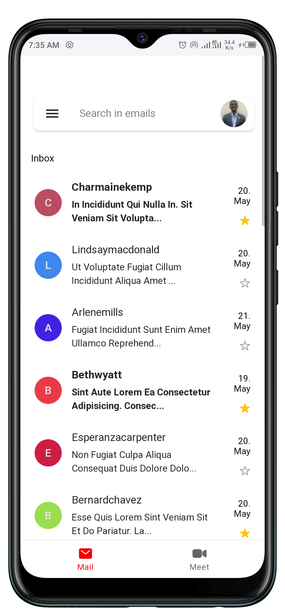
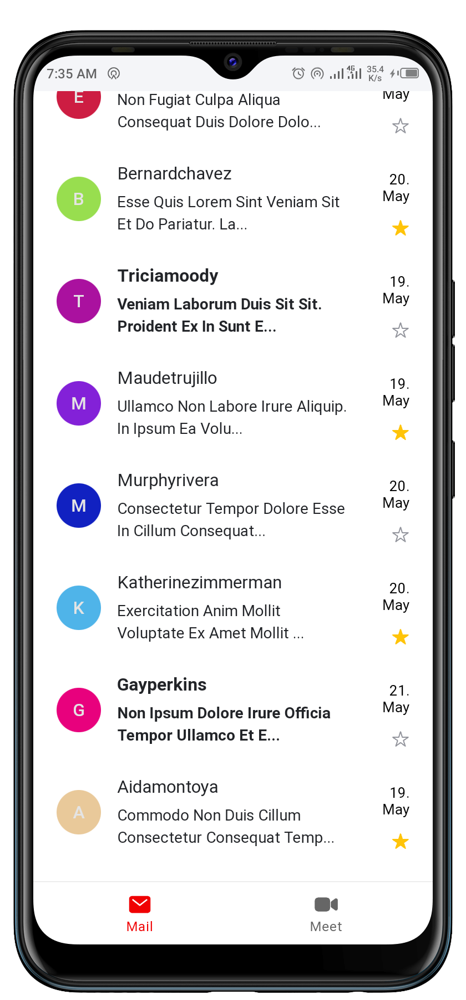
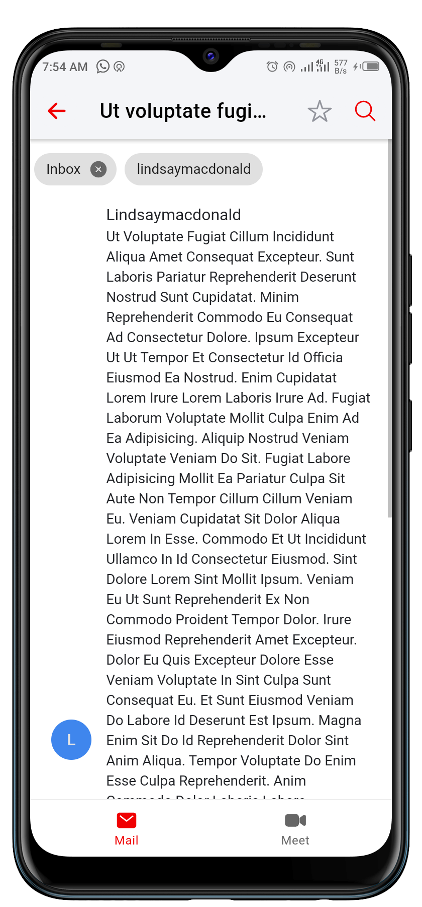
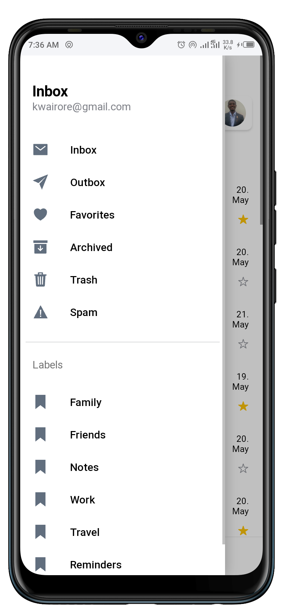
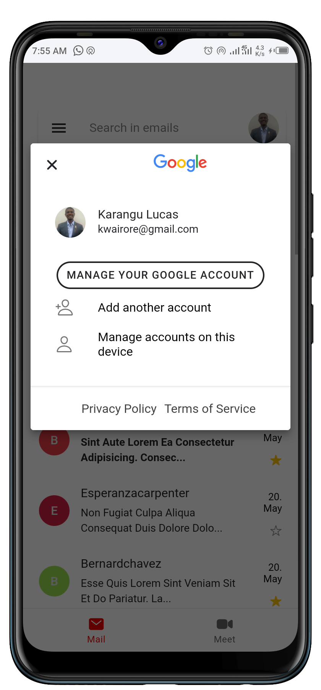

# Angular Gmeil Clone
Angular Gmeil Clone is a simple similar clone of the popular Gmail.

Angular Gmeil Clone implements the combination of a tab bar and side menu, plus the inbox UI known from Gmail.

# Demo
Here is a working live demo: [https://gmeil-clone.web.app](https://gmeil-clone.web.app)

## Homepage

## Email details

## Side Menu with Tab Bar

## Account Popover
