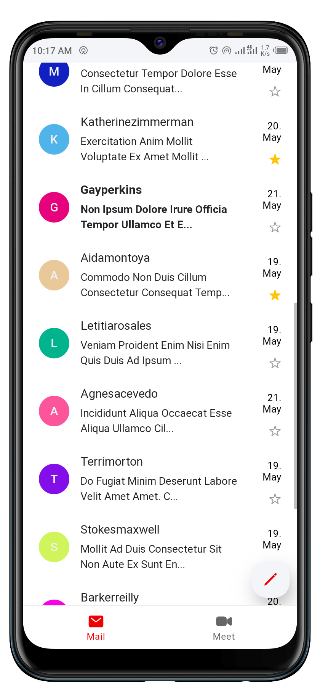

# Angular Gmeil Clone
Angular Gmeil Clone is a simple similar clone of the popular Gmail.

Angular Gmeil Clone implements the combination of a tab bar and side menu, plus the inbox UI known from Gmail.

# Demo
Here is a working live demo: [https://gmeil-clone.web.app](https://gmeil-clone.web.app)

## Homepage

## Email details

## Side Menu with Tab Bar

## Account Popover

# Built with
- [Ionic](https://ionicframework.com/)
- [Angular](https://angular.io/)

# Reading resources
- [Ionic](https://ionicframework.com/) - An open source mobile UI toolkit for building high quality, cross-platform native and web app experiences. Move faster with a single code base, running everywhere with JavaScript and the Web.
- [Angular](is a front-end web framework built by Google. It allows developers to build a single-page applications modeled around a *model-view-controller* (MVC) or *model-view-viewmodel*(MVVM) software architectural pattern. This architecture divides applications into different, but connected parts allowing for parallel development. Following this pattern, Angular splits its different components into the respective parts of a web application. Its components manage the data and logic that pertain to that component, display the data in its respective view, and adapts or controls the view based on the different messages that it receives from the rest of the app.)

# Team
[Karangu Lucas](https://github.com/lwairore)